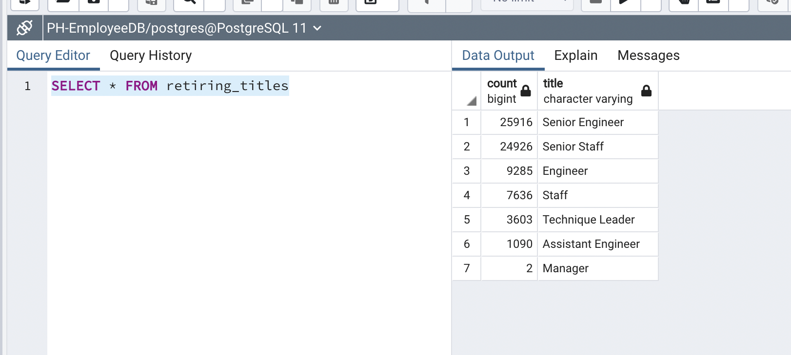
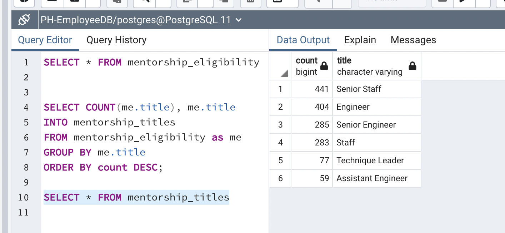
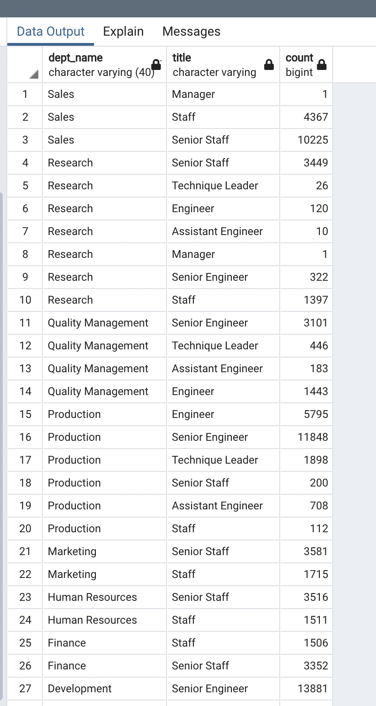
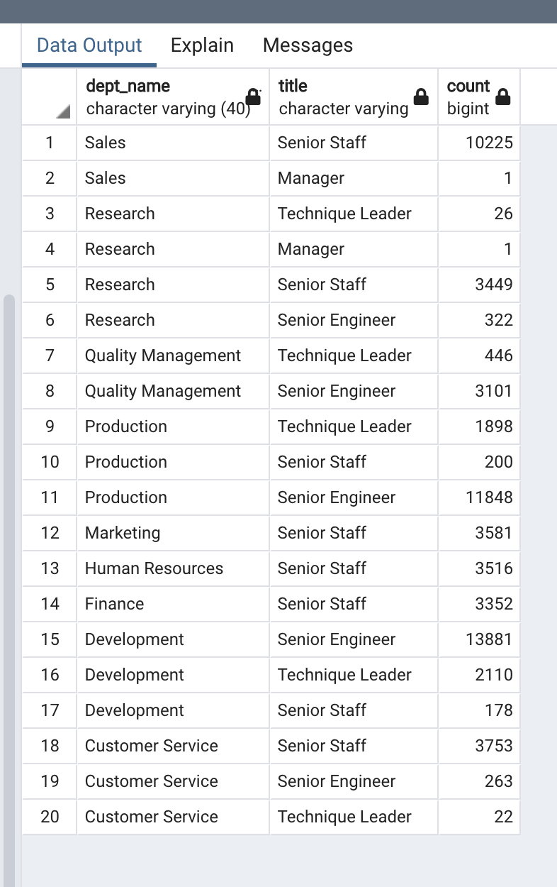

# Pewlett-Hackard-Analysis

## Overview of the analysis

### Purpose

The purpose of the current analysis is to determine the number of retiring employees per title, as well as to identify the employees who are eligible for the mentorship  program in order to be ready to fill soon to be vacant positions. 

## Results

  1.  72,458 out of 300,024 employees are eligible for retirement. 
  
  2.  Almost 80% of the eligible retirees hold senior positions in the company, 29,414 Senior Engineers and 28,255 Senior Staff.  

.

  3.  1,549 employees are eligible for mentorship program.

  4.  Around 5% of the current employees will be available to fill soon-to-be vacant positions. 

.

## Summary

72,458 positions will need to be filled once "silver tsunami" begins to make an impact. Considering there are only 1,549 employees eligible for the mentorship program, Pewlett Hackard Company will have a big deficit once all the eligible employees retire. To understand the effect on each individual department, I ran an additional analysis that shows that the most effected departments are Development, Production, and Sales. 

.

80% of the retirees are employees at the senior level and manager/leadership postions. I ran additional analysis to see how many qualified, retirement-ready employees are available by department to train the next generation of Pewlett Hackard employees. 

.
